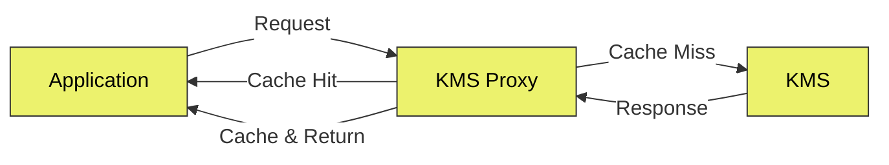

## Overview

KMS Proxy is a client-side daemon that acts as an API proxy for KMS, providing caching capabilities for high availability. Applications connect to the proxy instead of directly to KMS, and the proxy handles request forwarding, response caching, and automatic cache refresh.

**Key features:**

- **API Proxy**: Forwards all requests to your KMS instance transparently
- **Caching**: Caches secret responses in-memory with automatic refresh
- **High Availability**: Continues serving cached secrets even when KMS is unreachable (optimistic eviction strategy)
- **Automatic Cache Invalidation**: Purges stale cache entries when secrets are mutated through the proxy
- **Token Validation**: Periodically validates access tokens and evicts entries for revoked tokens
- **TLS Support**: Supports TLS encryption for secure communication

<Note>
The KMS Proxy is ideal for scenarios where you need to reduce load on your KMS instance, improve response times, or ensure secret availability during network disruptions.
</Note>

## How It Works



The KMS Proxy sits between your applications and your KMS instance, acting as a transparent intermediary. Applications make requests to the proxy using the same API endpoints they would use with KMS directly, simply replace your KMS host URL with the proxy's address. The proxy handles authentication headers transparently, forwarding them to KMS as needed.

When a request arrives, the proxy first checks its in-memory cache for a matching response. Cache lookups are based on the request method, path, query parameters, and authentication token, ensuring that different users and query variations are cached separately. If a matching entry exists, the proxy returns the cached response immediately without contacting KMS, significantly reducing latency and load on your KMS instance.

For requests that aren't in the cache, the proxy forwards them to KMS, waits for the response, and then stores the response in its cache before returning it to the application. This means the first request for any unique combination of parameters will have normal latency, but subsequent identical requests will be served from cache.

To keep cached data fresh, the proxy runs two background processes. The first periodically validates that cached access tokens are still valid by making test requests to KMS. If a token has been revoked, all cache entries associated with that token are immediately evicted. The second process refreshes cached secrets on a configurable interval, re-fetching data from KMS and updating the cache with the latest values. Both processes use an optimistic strategy: if KMS is unreachable, the proxy continues serving cached data rather than evicting entries, ensuring your applications remain operational during outages.

## Install the KMS Proxy

The KMS Proxy is available through the KMS CLI. Please refer to the [CLI installation documentation](/cli/overview) for more information on how to install the KMS CLI.

## Quick Start

Start the proxy with minimal configuration:
```bash
kms proxy start \
  --domain=https://kms.hanzo.ai \
  --listen-address=localhost:8081 \
  --tls-enabled=false
```

Then configure your application to use `http://localhost:8081` as the KMS host instead of `https://kms.hanzo.ai`.

<Warning>
  For production deployments, it is strongly recommended to enable TLS by providing `--tls-cert-file` and `--tls-key-file`, and setting `--tls-enabled` to `true`.
</Warning>


## Configuration

### Command Options

<ParamField query="--domain" type="string" required>
  Domain of your KMS instance (e.g., https://kms.hanzo.ai)
</ParamField>
<ParamField query="--listen-address" type="string" required>
  Address and port for the proxy to listen on, e.g. `localhost:8081`
</ParamField>

<ParamField query="--tls-enabled" type="boolean" default={true}>
  Whether to enable TLS encryption for secure communication for the proxy. Defaults to `true`.
  
  Note that all communication between the proxy and KMS is always encrypted by default. If you are self-hosting your KMS instance, ensure that your KMS instance is configured to use TLS.
</ParamField>

<ParamField query="--tls-cert-file" type="string" optional>
  Path to the TLS certificate file to use for proxy TLS encryption. This field is required if `--tls-enabled` is `true`.
</ParamField>

<ParamField query="--tls-key-file" type="string" optional>
  Path to the TLS private key file. This field is required if `--tls-enabled` is `true`.
</ParamField>

<ParamField query="--eviction-strategy" type="string" default="optimistic">
  The eviction strategy to use for cached secrets. Defaults to `optimistic`, and currently this is the only supported eviction strategy.
  
  The eviction strategy is used to determine when to evict cached secrets from the cache.
  - `optimistic` - Only evict cached secrets when the proxy is able to reach KMS and verify that the underlying cached secret is stale.
</ParamField>

<ParamField query="--access-token-check-interval" type="duration" default="5m">
  How often to validate that access tokens are still valid. If a token is deemed to be invalid _(such as if it has been revoked or has expired)_, the proxy will evict all cached secrets that are associated with that token. Supports duration formats like `60s|5m|1h|1d|1w|1y`.
</ParamField>

<ParamField query="--static-secrets-refresh-interval" type="duration" default="1h">
  How often to refresh cached secrets from KMS. Defaults to `1h`. Supports duration formats like `60s|5m|1h|1d|1w|1y`.
</ParamField>

# Caching Behavior

### What Gets Cached

The proxy selectively caches responses to optimize for the most common secret retrieval patterns.
Only `GET` requests to secret endpoints are cached. This includes the list and retrieve endpoints across both API versions (`/api/v3/secrets` and `/api/v4/secrets`), as well as their raw variants and any sub-paths.
These endpoints represent read operations where caching provides the most benefit: reducing latency for frequently accessed secrets and decreasing load on your KMS instance.

All other requests pass through the proxy without caching. This includes mutation operations like creating, updating, or deleting secrets (`POST`, `PATCH`, `DELETE`), as well as requests to non-secret endpoints such as authentication, project management, or user operations.
These requests are forwarded directly to KMS and their responses are returned to the application without being stored. This design ensures that write operations always reach KMS immediately and that the cache only contains secret data that benefits from being cached.

### Request Uniqueness

Each cache entry is uniquely identified by a SHA-256 hash of the request's method, path, query parameters, and authentication token.
This ensures that different query combinations and users are cached separately.

The cache key is constructed as follows:

```
sha256(method + path + query + access_token)
```

### Automatic Cache Refresh

The proxy automatically refreshes cached secrets and validates cached access tokens to ensure the data in the cache remains fresh and valid.

#### Access Token Validation

The proxy periodically validates that cached access tokens are still valid, running every 5 minutes by default.
For each unique token in the cache, the proxy makes a test request to KMS using one of that token's cached requests.
If KMS returns `401 Unauthorized` or `403 Forbidden`, all cache entries associated with that token are immediately evicted.

**When the proxy is configured with the optimistic eviction strategy**:
If KMS is unreachable during token validation (network errors or `5xx` responses), the proxy keeps cached entries intact rather than evicting them. This ensures that your applications remain operational even if KMS is temporarily unavailable.

#### Static Secrets Refresh

The proxy automatically refreshes cached secrets to ensure data stays current, running every hour by default.
During each refresh cycle, the proxy identifies all cache entries that were last updated longer ago than the refresh interval, then re-fetches each one from KMS.
Successful responses update the cached data with fresh values. Entries that return `401`, `403`, or `404` during refresh are evicted from the cache, as these indicate the token has lost access or the resource no longer exists.

**When the proxy is configured with the `optimistic` eviction strategy**:
If KMS is unreachable during the refresh cycle (network errors or `5xx` responses), the proxy keeps cached entries intact rather than evicting them. This ensures that your applications remain operational even if KMS is temporarily unavailable.


### Mutation-Based Cache Invalidation

When a mutation request is processed through the proxy (`POST`, `PATCH`, or `DELETE` requests), the proxy extracts the `projectId`, `environment`, and `secretPath` from the request body and purges all cache entries that match these criteria—regardless of which token was used to cache them.
This cross-token purging ensures that all users see consistent data after a secret is modified. The proxy also supports wildcard path matching, so a mutation to `/production/database` will invalidate cache entries for both exact path matches and recursive queries that included that path.

<Tip>
  For immediate cache invalidation, perform secret mutations through the proxy rather than directly to KMS. For optimal performance it's recommended to use the proxy for all API requests.
</Tip>

### Eviction Strategy
The eviction strategy is used to determine when to evict cached entries from the cache. Currently the KMS Proxy only supports the `optimistic` eviction strategy.

#### Optimistic Eviction
* Keeps cached data when KMS is unreachable (network errors, or `5xx` responses)
* Ensures high availability when your KMS instance is unreachable
* Cache entries are only evicted on:
  * Token invalidation (`401`/`403` response)
  * Resource not found (`404` response)
  * Explicit mutation through the proxy
  * Proxy restart _(when the proxy is restarted, all cached entries are evicted because the cache is stored in memory)_

<Note>
  The `optimistic` eviction strategy prioritizes availability. Applications will continue receiving cached secrets even if KMS is down, at the cost of potentially serving slightly stale data.
</Note>

## TLS Configuration
By default, TLS is enabled. For production deployments, provide your TLS certificate and key:

```bash
kms proxy start \
  --domain=https://kms.hanzo.ai \
  --listen-address=0.0.0.0:8081 \
  --tls-cert-file=/path/to/cert.pem \
  --tls-key-file=/path/to/key.pem
```

To disable TLS (**not recommended for production**):
```bash
kms proxy start \
  --domain=https://kms.hanzo.ai \
  --listen-address=localhost:8081 \
  --tls-enabled=false
```


## Examples

### Using the Proxy with SDKs 
Configure your KMS SDK to point to the proxy instead of KMS directly:


#### Node.js
```javascript
import { KMSSDK } from '@hanzo/kms-sdk'

const client = new KMSSDK({
  siteUrl: "http://localhost:8081", // Proxy address instead of KMS
  // ... other configuration options
});
```

#### Python SDK

```python
from kms_sdk import KMSSDKClient
client = KMSSDKClient(host="http://localhost:8081") # Proxy address instead of KMS
```

### Direct API Calls

```bash
# Instead of calling KMS directly:
# curl https://kms.hanzo.ai/api/v3/secrets/raw?...

# Call the proxy:
curl -G http://localhost:8081/api/v4/secrets \
  -H "Authorization: Bearer <your-access-token>" \
  --data-urlencode "projectId=<your-project-id>" \
  --data-urlencode "environment=dev" \
  --data-urlencode "secretPath=/" \
  --data-urlencode "recursive=true"
```

## Security Considerations

### Cache Encryption
All cached secret data is encrypted at rest in memory using AES-256 with GCM authentication.
Secrets are only decrypted momentarily when serving a response to a client, and are otherwise stored in encrypted form.
The encryption key is randomly generated at proxy startup and persists only for the lifetime of the process, and restarting the proxy generates a new key and clears all cached data.

The encryption key itself is protected in memory, using multiple layers of memory protection techniques.
* **Memory locking via `mlock()`:** prevents the key from being swapped to disk
* **Memory protection via `mprotect()`:** guards against buffer overflows and unauthorized access
* **Secure allocation via `mmap()`:** ensures the memory region is allocated safely
* **In-memory encryption using XSalsa20-Poly1305:** protects the key even within RAM


### Network Security

Enable TLS in production to encrypt traffic between your applications and the proxy.
Without TLS, secrets are transmitted in plaintext over the network between your applications and the proxy.


### Access Control
Restrict network access to the proxy's listen address to prevent unauthorized clients from querying cached secrets.
The proxy should only be accessible to trusted applications within your infrastructure.

### Token Isolation
The proxy caches responses separately for each authentication token.
If a token is compromised, only the cache entries associated with that specific token are exposed. Other tokens' cached data remains isolated and protected.

## Troubleshooting

<AccordionGroup>
  <Accordion title="Stale data after secret updates">
    If you're updating secrets directly in KMS (not through the proxy), the proxy will not automatically invalidate the cache. You will need to manually purge the cache by restarting the proxy, or by waiting for the next `static-secrets-refresh-interval` cycle.

    <Note>
      The `static-secrets-refresh-interval` is the interval at which the proxy will refresh cached secrets from KMS.
    </Note>

    For immediate invalidation, perform mutations through the proxy.
  </Accordion>
</AccordionGroup>

